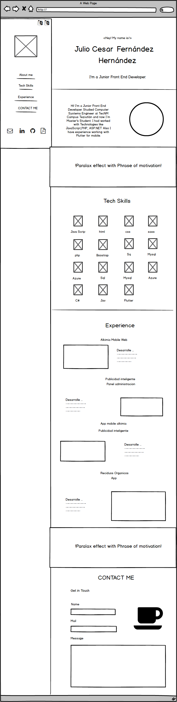

# Mi curiculum Web

## Link Pagina Web

https://julio-fernandez.github.io/MiCurriculum/

## Descripción y tecnologías

Curriculum Web desarrollado con las tecnologias de

- HTML
- CSS
- Bootstrap
- JavaScript

Maquetado desarrollado con las tecnologias

- Figma
- Balsamiq mockups.

Librerias para animaciones usadas

- Particles js
- Izimir Effect
- AOS
- Typed.js

# Maquetado

## Balsamic

## Figma

### Maqueta Web
https://www.figma.com/proto/UgqJIyRVc4rf6LHjXNItI8/CV-Resume-Template-(Community)?page-id=202%3A2&node-id=212%3A51&viewport=-814%2C944%2C0.39&scaling=scale-down-width&starting-point-node-id=212%3A51

